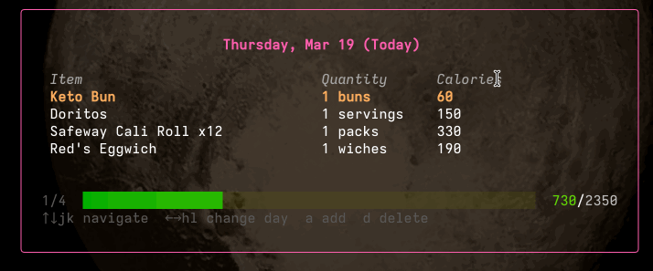

# Furnace

A terminal application for tracking what you eat:



You can:

- Add food items into your food library directly
- Create recipes / meals out of groups of other ingredients
- Optionally set a daily goal
- See a rolling 5-day average

## Installation

### Homebrew (macOS)

```sh
brew install tsraveling/tap/furnace
```

### Scoop (Windows)

```sh
scoop bucket add tsraveling https://github.com/tsraveling/scoop-bucket
scoop install furnace
```

### Arch Linux (AUR)

```sh
yay -S furnace-bin
```

### Debian / Ubuntu / Fedora / Alpine

Download the `.deb`, `.rpm`, or `.apk` from the [latest release](https://github.com/tsraveling/furnace/releases/latest) and install with your package manager, e.g.:

```sh
sudo dpkg -i furnace_*.deb
```

### Go

```sh
go install github.com/tsraveling/furnace@latest
```

### Manual

Download the archive for your platform from the [latest release](https://github.com/tsraveling/furnace/releases/latest), extract, and place `furnace` on your `PATH`.

## Setup

Run `furnace` in your terminal. On first run, if no config file exists, Furnace will offer to create one with defaults (`homeFolder = "~/furnace"`, `dailyTarget = 2000`). That's it!

### Config

Furnace reads its config from `~/.config/furnace/config.ini`:

```
[general]
homeFolder = "~/furnace"

# Remove this line if you don't want a daily caloric target.
dailyTarget = 2000
```

- `homeFolder` — the folder where Furnace stores its `logs.md`, `food.md`, and `recipes.md` files (mine is in my Obsidian folder so it syncs between devices)
- `dailyTarget` — optional; set it to see a daily progress bar comparing what you've eaten to your target. Remove it for no target.

## Usage

You can see a **summary view** by simply typing `furnace`. This will show your logs for today and a calorie total. Follow the instructions in the help text to page through days, add items, etc. You can also log items, create food, create recipes, etc. from this view.

You can shortcut to logging a new item by typing `furnace log`. This will drop you into the picker flow. If you type e.g. `furnace log beans` then it will drop you into the picker flow with "beans" prepopulated into the search field.

### Editing Logs and Food Items

For now, you cannot edit logs or food items from inside Furnace (although this is coming soon!). So instead simply use the text editor of your choice to edit either `logs.md` or `food.md` in the home folder you set above. `recipes.md` contains recipes.

- Logs has the format `date | item | quantity` (e.g. of servings)
- Food has the format `item | units | calories`

Recipes have this format:

```
# Egg and Beans Breakfast
bowls | 0
- Small Fiber Tortilla | 2
- Black Beans | 0.6
- Egg White | 2
- Egg | 2
```

The number following the title is the amount of "extra calories" per serving of the meal / recipe. The number following each ingredient is the number of servings of that ingredient per serving of the recipe.

Then your total daily caloric intake is outputted as `items today * quantity in units * calories per unit`. Easy!

## License

[GNU GPL v3](LICENSE)


